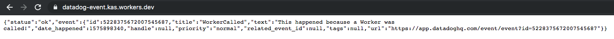
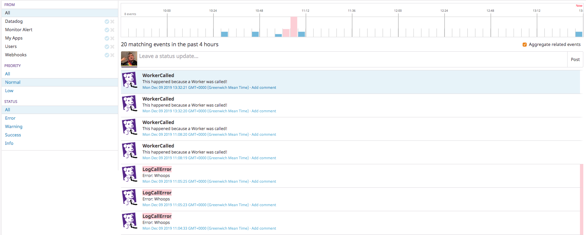

# Using Datadog to log Cloudflare Workers Events

Today we'll take a look at using Datadog's HTTP API to log Cloudflare Workers events. Event logging is crucial for observability and debugging of Cloudflare Workers functions, and Datadog's Events API provides a great way to log and view these events on a real-time dashboard.

We'll be using the `fetch` function to call the Datadog Event API to log an event when a Worker is called, and using `event.waitUntil(function())` to make sure an event is logged if an error is thrown in the Worker.

## Getting set up with Wrangler

We'll be using the [Wrangler CLI tool](https://developers.cloudflare.com/workers/quickstart/) to set up our function and get it ready to deploy. You'll need your [Cloudflare Account ID](https://developers.cloudflare.com/workers/quickstart/#account-id-and-zone-id) to put into the `wrangler.toml`.

First, create a generic JavaScript worker using Wrangler:

```
wrangler generate datadog-event-worker
```

Then, add your Cloudflare account ID in the `wrangler.toml` under `account_id`.

## How we'll integrate: the Datadog HTTP API

Taking a look at the [Datadog HTTP API documentation](https://docs.datadoghq.com/api/?lang=bash#api-reference), you'll need your API key and your Application key handy to code this Worker. We'll be using the `POST /v1/events` endpoint, which requires authorization. They'll go at the very top of our Worker in `index.js`:

```
const DATADOG_APP_KEY = "your-app-key"
const DATADOG_API_KEY = "your-api-key"
```

## Using the `fetch` API to log a `call` event

First, we'll set up our Worker to call `fetch` to the Datadog Events endpoint when the function is called. This is a `POST` request, and we'll need to set the auth headers and add some event data:

```
addEventListener('fetch', event => {
  event.passThroughOnException()
  event.respondWith(handleRequest(event.request, event))
})

async function handleRequest(request, event) {
	response = await postCallEvent()
	return response
}

async function postCallEvent() {
  return await fetch(`https://api.datadoghq.com/api/v1/events?api_key=${DATADOG_API_KEY}`, {
    method: 'POST',
    headers: {
      'Content-Type': 'application/json',
      'DD-APPLICATION-KEY': DATADOG_APP_KEY,
      'DD-API-KEY': DATADOG_API_KEY
    },
    body: JSON.stringify({
      title: 'WorkerCalled',
      text: 'This happened because a Worker was called!',
      priority: 'normal',
      alert_type: "info"
    })
  })
}
```

This code will send events when everything functions correctly, but what if there's an error? Let's add some error-catching code to prevent silence in this case.

## Using the `event.waitUntil(function())` function to log errors

We'll need to add a `try{} catch(){}` block around our original function code, and in the `catch` block, add a call to the Event API that logs the error. We'll wrap this call in `event.waitUntil` to make sure it executes before the Worker stops running.

```
async function handleRequest(request, event) {
  try {
    response = await postCallEvent()
    return response
  } catch (error) {
    event.waitUntil(postErrorEvent(event, error))
    return new Response('The call event threw an error')
  }
}

async function postCallEvent() {
  return await fetch(`https://api.datadoghq.com/api/v1/events?api_key=${DATADOG_API_KEY}`, {
    method: 'POST',
    headers: {
      'Content-Type': 'application/json',
      'DD-APPLICATION-KEY': DATADOG_APP_KEY,
      'DD-API-KEY': DATADOG_API_KEY
    },
    body: JSON.stringify({
      title: 'WorkerCalled',
      text: 'This happened because a Worker was called!',
      priority: 'normal',
      alert_type: "info"
    })
  })
}

async function postErrorEvent(event, error) {
  return await fetch(`https://api.datadoghq.com/api/v1/events?api_key=${DATADOG_API_KEY}`, {
    method: 'POST',
    headers: {
      'Content-Type': 'application/json',
      'DD-APPLICATION-KEY': DATADOG_APP_KEY,
      'DD-API-KEY': DATADOG_API_KEY
    },
    body: JSON.stringify({
      title: 'LogCallError',
      text: error.toString(),
      priority: 'high',
      alert_type: "error"
    })
  })
}
```
Now that our code handles errors as well as normal cases, let's use Wrangler to deploy and test it!

## The final worker

Your full `index.js` file should look like the following:

```
const DATADOG_APP_KEY = ""
const DATADOG_API_KEY = ""

addEventListener('fetch', event => {
  event.passThroughOnException()
  event.respondWith(handleRequest(event.request, event))
})
/**
 * Respond with hello worker text
 * @param {Request} request
 */
async function handleRequest(request, event) {
  try {
    response = await postCallEvent()
    return response
  } catch (error) {
    event.waitUntil(postErrorEvent(event, error))
    return new Response('The call event threw an error')
  }
}

async function postCallEvent() {
  return await fetch(`https://api.datadoghq.com/api/v1/events?api_key=${DATADOG_API_KEY}`, {
    method: 'POST',
    headers: {
      'Content-Type': 'application/json',
      'DD-APPLICATION-KEY': DATADOG_APP_KEY,
      'DD-API-KEY': DATADOG_API_KEY
    },
    body: JSON.stringify({
      title: 'WorkerCalled',
      text: 'This happened because a Worker was called!',
      priority: 'normal',
      alert_type: "info"
    })
  })
}

async function postErrorEvent(event, error) {
  return await fetch(`https://api.datadoghq.com/api/v1/events?api_key=${DATADOG_API_KEY}`, {
    method: 'POST',
    headers: {
      'Content-Type': 'application/json',
      'DD-APPLICATION-KEY': DATADOG_APP_KEY,
      'DD-API-KEY': DATADOG_API_KEY
    },
    body: JSON.stringify({
      title: 'LogCallError',
      text: error.toString(),
      priority: 'high',
      alert_type: "error"
    })
  })
}
```

Once your Worker code is ready and you've put your Cloudflare account ID in your `wrangler.toml`, you can deploy your function:

```
wrangler publish
```

Once you've done that, you'll get a URL. Go to it, and you should see something like the following:



And you should see events on your Datadog dashboard (I've taken the liberty of firing a few error events off for this picture):



## Conclusion

You can see the code from this post [on GitHub](https://github.com/nodebotanist/datadog-workers-experiments/tree/master/code/datadog-event). 

You now have a tool for adding more observability and insight into how your Workers function, thanks to integrating one of Datadog's REST APIs.

